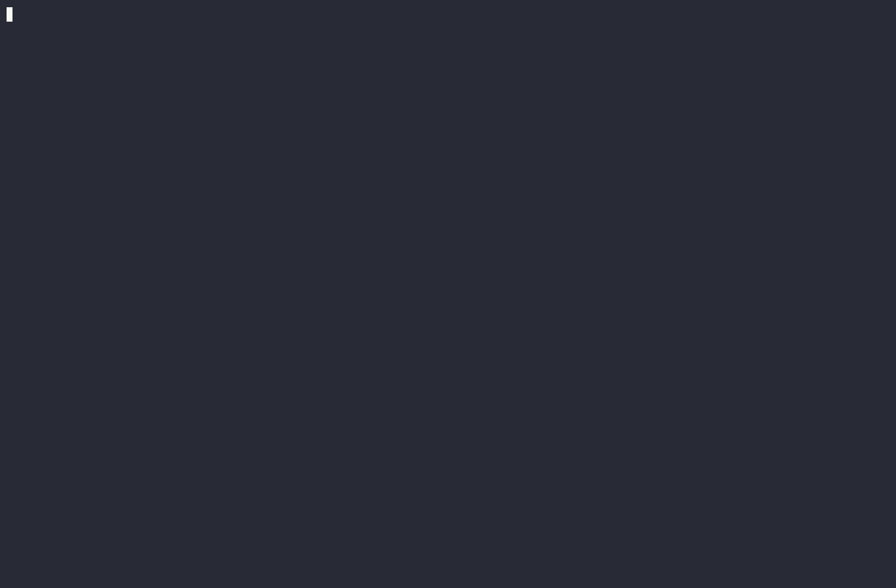

# ssmer

A terminal UI for opening shell sessions and port forwards to EC2 instances through
[AWS Systems Manager Session Manager](https://docs.aws.amazon.com/systems-manager/latest/userguide/session-manager.html):
no SSH, no bastion hosts, no open inbound ports.



- Browse instances in a region and fuzzy-search them by `Name` tag
- Open an interactive shell, then return to the list when you `exit`
- Forward any remote port to localhost (RDP by default) and see each tunnel's status
- Fetch a Windows Administrator password and copy it to the clipboard

It is a single Python file that needs only the standard library and the AWS CLI.

## Requirements

- Linux or macOS (or WSL)
- Python 3.10+
- [AWS CLI v2](https://docs.aws.amazon.com/cli/latest/userguide/getting-started-install.html) and the
  [Session Manager plugin](https://docs.aws.amazon.com/systems-manager/latest/userguide/session-manager-working-with-install-plugin.html)
- Instances managed by SSM

## Install and run

```sh
./ssmer.py                 # run from the clone
pipx install .             # or install the `ssmer` command
```

| Option / variable | Effect |
| --- | --- |
| `--profile NAME` | AWS CLI profile to use |
| `--region NAME` | Preselect a region |
| `--keys-dir DIR`, `SSMER_KEYS_DIR` | Where EC2 key files live (default: `keys/` beside `ssmer.py`) |
| `SSMER_REGIONS` | Comma-separated regions for the picker |

Your credentials need `ec2:DescribeInstances`, `ssm:DescribeInstanceInformation`, `ssm:StartSession`,
`ssm:TerminateSession` and `ssm:ResumeSession`. `ec2:GetPasswordData` (Windows passwords) and
`iam:ListAccountAliases` (shows the account alias) are optional.

## Controls

| Key | Action |
| --- | --- |
| `↑` `↓` / `j` `k` | Move |
| `Enter` | Connect (`c`) or port forward (`p`) |
| `/` | Search (instance names, or region codes and places in the region picker) |
| `d` / `D` | Disconnect this instance's forwards / all forwards |
| `r` | Reload |
| `g` | Switch region (grouped by area; `/` then `tokyo` finds `ap-northeast-1`) |
| `q` / `Esc` | Quit (port forwards keep running unless you choose *Quit + disconnect*) |

## Windows passwords

Put your EC2 private keys in `keys/` (or `--keys-dir`). After starting a port forward, ssmer offers to fetch
the Administrator password, preselecting the instance's launch key. Everything in `keys/` except the
placeholder note is git-ignored.

## Development

```sh
python3 -m unittest discover -s tests -t .
ruff check .
```

## License

[MIT](LICENSE)
